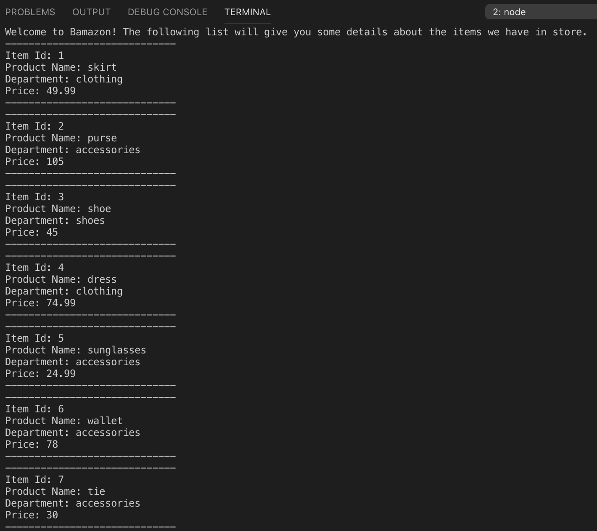
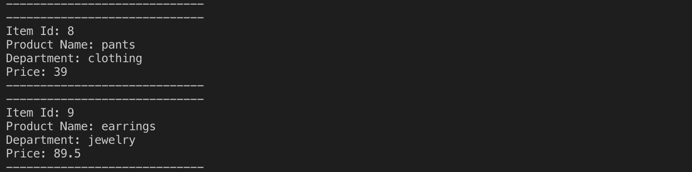
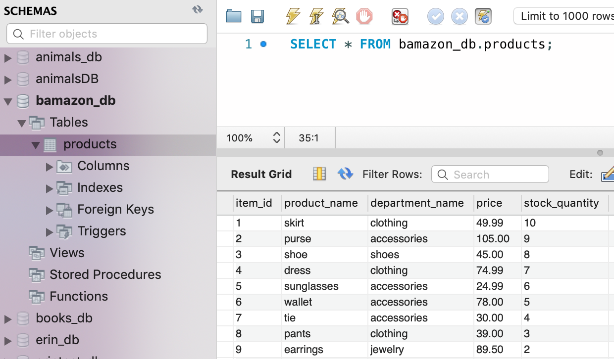
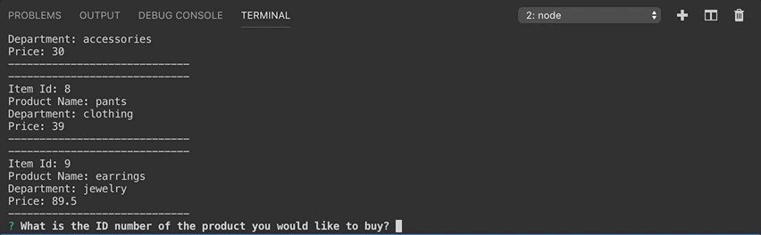
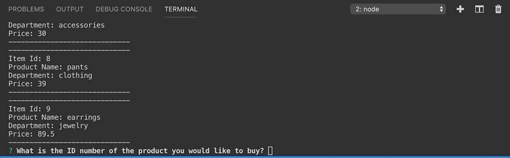
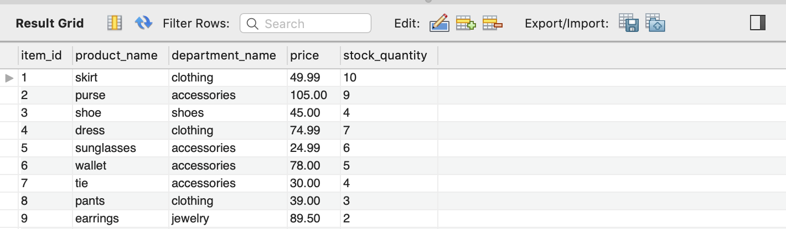

# bamazon

Bamazon is an Amazon-like storefront built with Node.js and mySQL. The app will take in orders from customers and deplete stock from the store's inventory. 

:large_blue_diamond: Running this application will first display all of the items available for sale. Include the ids, names, and prices of products for sale.

:large_blue_diamond: Here is what the list looks like in mySQL:

:large_blue_diamond: The app should then prompt users with two messages. The first should ask them the ID of the product they would like to buy. The second message should ask how many units of the product they would like to buy. Once the customer has placed the order, your application should check if your store has enough of the product to meet the customer's request. If not, the app should log a phrase like Insufficient quantity!, and then prevent the order from going through.

:large_blue_diamond: However, if your store does have enough of the product, you should fulfill the customer's order. Show the customer the total cost of their purchase.

:large_blue_diamond: This means updating the SQL database to reflect the remaining quantity (check out item ID 3!).

